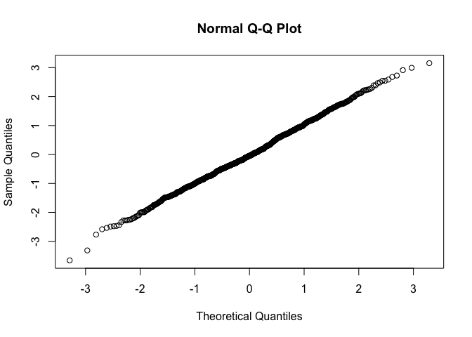

```r
# Preamble 
library(tidyverse)
library(gridExtra)
library(moments)

knitr::opts_chunk$set(fig.align = "center")
```

*A note to the reader:* This blog post is dedicated to the idea of assessing normality in data. It was part of a bigger project which outlines the most important principles of the exploratory data analysis (EDA) process. 

One of the most common problems we face as data scientists is figuring distributional properties of data. Identifying these distributions is a key step in EDA and influences many choices about the stories we choose to tell with the data going forward. As statisticians, we often gravitate towards saying our data *is* normal (or Guassian) distributions simply because they are convenient. It is incredibly easy work with and specify (even in non-technical settings) since it you can define it in terms of just its mean and standard deviation. With just two values, the picture becomes abundantly clear because almost everyone knows how the values are distributed (see. fig 1). 


But just because it *would be* convenient for data to be normally distributed, it does not mean *it is* normally distributed. We explore a few tools for determining whether or not a single variable in your data is indeed normal. The most basic (and sometimes most powerful) of tools will be **visual diagnostics**. These are a series of plots that can easily be generated in order to determine the shape of the distribution of a variable. Beyond that, there are some more rigorous numerical summaries and hypothesis tests for doing this. Namely, examining the skewness and kurtosis and developping a hypothesis test from bootstrapping principles (more on this later - KAMAL TO FILL IN)

## Why do we care about distributions? 

Before diving into how to find the distribution of something, its worth noting why we even care! In doing this, we gain insight into the range of possible values our data can take. This information is useful in determining possible outliers and for fitting statistical models down the line. 

# Visual Diagnostics

The histogram is created by grouping values into ranges and counting how many points are within each interval. These counts are then graphed as bars and the resulting picture can be used to determine the shape of the data's distribution. In the case of normal distribution, this picture would be a symetric mound shaped distribution (I hate the phrasing mound-shaped). 


```r
normal_sample_1 <- tibble(sample_1 = rnorm(1000, mean = -10, sd = 10))
normal_sample_2 <- tibble(sample_2 = rnorm(1000, mean = 0, sd = 5))
normal_sample_3 <- tibble(sample_3 = rnorm(1000, mean = 10, sd = 5))

normal_hist_1 <- normal_sample_1 %>% ggplot(aes(sample_1)) + 
        geom_histogram(fill = 'steelblue', colour = 'navy', alpha = 0.7, bins = 20) + 
        labs(title = 'The Normal Distribution Histogram',
             subtitle = 'Mean: -10, SD: 10',
             x = 'Value',
             y = 'Count') +
        theme_minimal()

normal_hist_2 <- normal_sample_2 %>% ggplot(aes(sample_2)) + 
        geom_histogram(fill = 'steelblue', colour = 'navy', alpha = 0.7, bins = 20) + 
        labs(title = 'The Normal Distribution Histogram',
             subtitle = 'Mean: 0, SD: 5',
             x = 'Value',
             y = 'Count') +
        theme_minimal()

normal_hist_3 <- normal_sample_3 %>% ggplot(aes(sample_4)) + 
        geom_histogram(fill = 'steelblue', colour = 'navy', alpha = 0.7,bins = 20) + 
        labs(title = 'The Normal Distribution Histogram',
             subtitle = 'Mean: 10, SD: 15',
             x = 'Value',
             y = 'Count') +
        theme_minimal()

grid.arrange(normal_hist_1, normal_hist_2, normal_hist_1, nrow = 3)
```


# Building Blocks 

```r
# generate sequence of x
x <- seq(-100, 100, 0.1)

# generate associted normals 
y_norm <- dnorm(x, mean = -10, sd = 10)
y_norm_narrow <- dnorm(x, sd = 1)
y_norm_wide <- dnorm(x, mean = 10, sd = 15)

# create a dataframe 
df <- tibble(x, y_norm, y_norm_narrow, y_norm_wide)
```


```r
df %>% ggplot(aes(x = x)) +
     geom_line(aes(y = y_norm), colour = 'red') + 
     geom_line(aes(y = y_norm_narrow), colour = 'steelblue') + 
     geom_line(aes(y = y_norm_wide), colour = 'darkgreen') +
     labs(title = 'The Normal Distribution',
          subtitle = 'Varying parameters',
          x = 'Value',
          y = 'Probability') + 
     theme_minimal()
```


```r
t_variant_1 <- dt(x -10, 1.5)
t_variant_2 <- dt(x, 0.5)
t_variant_3 <- dt(x + 10, 1)


df_t <- tibble(x, 
               t_dist_1 = t_variant_1, 
               t_dist_2 = t_variant_2, 
               t_dist_3 = t_variant_3)

df_t %>% ggplot(aes(x = x)) +
     geom_line(aes(y = t_dist_1), colour = 'red') + 
     geom_line(aes(y = t_dist_2), colour = 'steelblue') + 
     geom_line(aes(y = t_dist_3), colour = 'darkgreen') +
     labs(title = 'The Non-Normal Distribution',
          subtitle = 'Varying parameters',
          x = 'Value',
          y = 'Probability') + 
     coord_cartesian(xlim = c(-25, 25)) + 
     theme_minimal()
```


```r
df_resemblence <- tibble(x, y_norm_narrow, t_variant_3)
df_resemblence %>% ggplot(aes(x=x)) + 
     geom_line(aes(y = y_norm_narrow), colour = 'steelblue') + 
     geom_line(aes(y = t_variant_3), colour = 'darkgreen') +
     coord_cartesian(xlim = c(-40, 40)) + 
     theme_minimal()
```


QQ-Plot for that janky-ass t distribution

```r
random_sample = rt(n = 1000, 100)

df_resemblence %>% ggplot(aes(sample = t_variant_3)) +
     stat_qq() +
     coord_cartesian(xlim = c(-10, 10), 
                     ylim = c(-2, 2)) + 
     theme_minimal()
```


```r
qqnorm(random_sample)
```


Punchline: you have a t and a normal that both look normal but this not good. 


```r
set.seed(123634)
# normal
c(skewness(rnorm(1000, x, sd = 1)), kurtosis(rnorm(1000, x, sd = 1)))
```

```
## [1] 0.0002178582 1.8012881759
```

```r
# not normal
c(skewness(rt(1000, 50)), kurtosis(rt(1000, 50)))
```

```
## [1] 0.0186652 3.4140928
```

```r
c(skewness(rt(1000, 4)), kurtosis(rt(1000, 4)))
```

```
## [1] 0.4760541 7.8833784
```

```r
c(skewness(rt(1000, 0.5)), kurtosis(rt(1000, 0.5)))
```

```
## [1] -24.69825 445.75428
```

# Normal Distribution 


# Narrow Normal Distribution


# Wide Normal Distribution 


# A well picked out t-distribution that looks normal 
